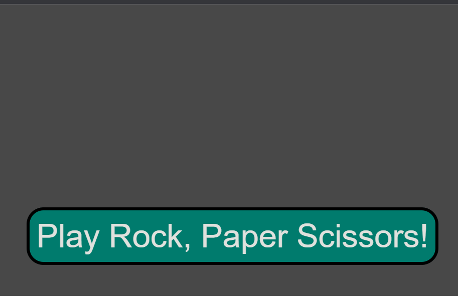

# **Rock, Paper, Scissors!**

A simple Rock Paper Scissors game that pits the user against the computer using javascript prompts and alerts.

---

## Contents:
* [Live Page Link](#live-page-link)
* [Demo](#demo)
* [Skills/Concepts Used](#skillsconcepts-used)
* [Steps Taken](#steps-taken)

---

## Live Page Link:

[https://rbishop85.github.io/rock-paper-scissors/](https://rbishop85.github.io/rock-paper-scissors/)

---

## Demo:

---

## Skills/Concepts Used:
* Javascript
* HTML
* CSS

---
## Steps Taken:
1. This project began as a small in-class group asignment where we each worked to generate the game while discussing how to accomplish it.
2. Game was later updated to using objects to store data and tallying ongoing score with help from teacher.
3. Later game was tweaked to make the alerts a bit more verbose.
4. Finally a start button to intialize game was added using similar code to a previous project and then updated to match this project's needs.

---

[Top of Page](#rock-paper-scissors)